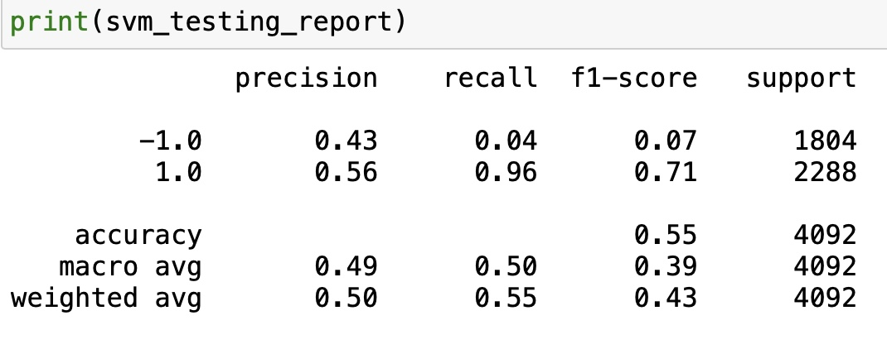
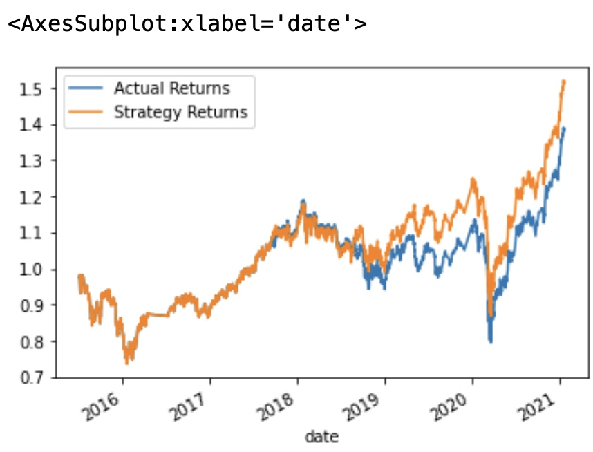
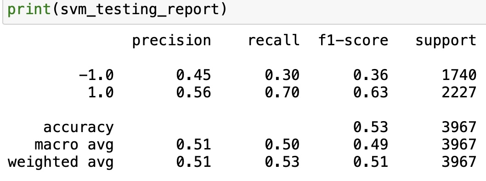
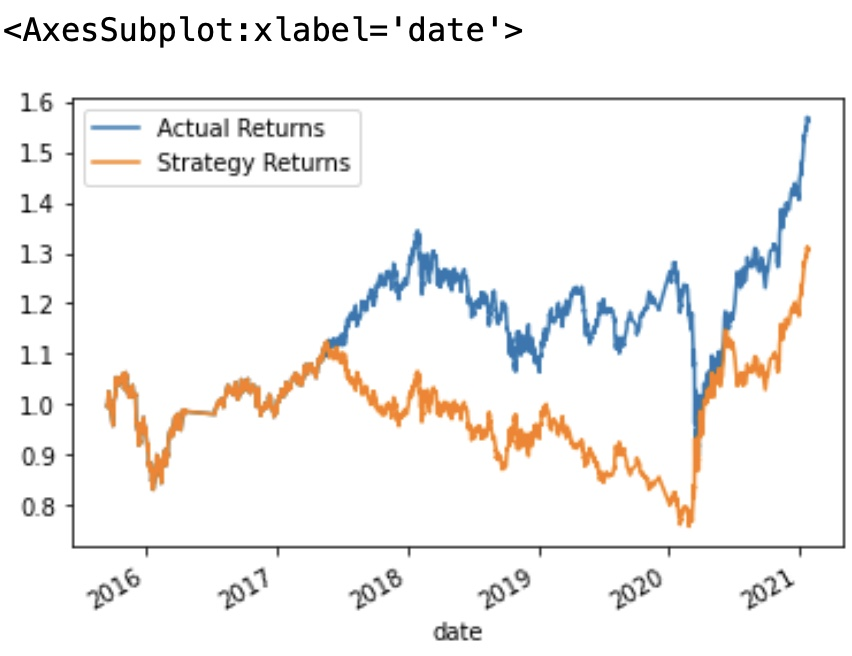
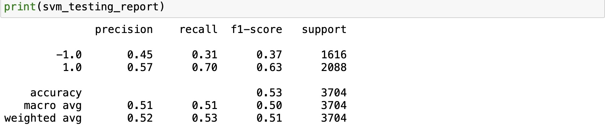
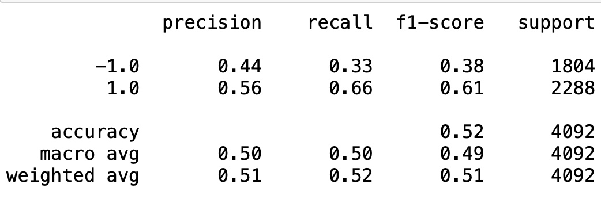
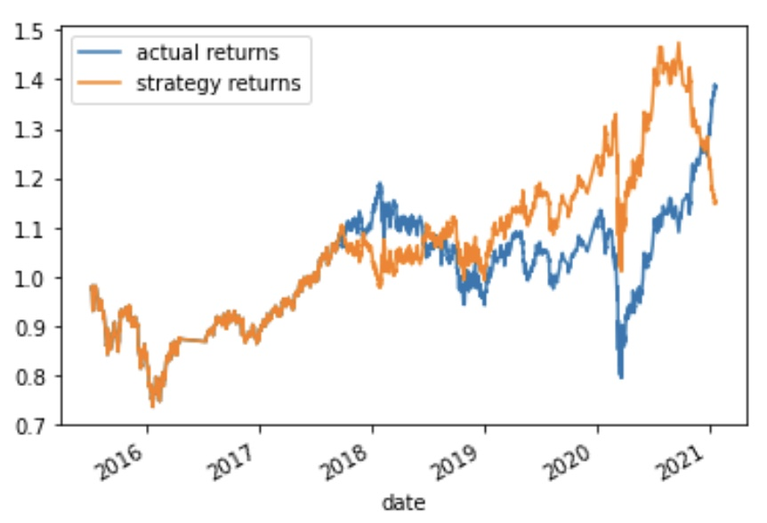

# Analysis Report with different ML data slice

---
---
### This is the original analysis data

---   

### This is the data with SMA sort_term set_to 30 days

---   

### This is the data with DateOffset 9 months

---   

### Question and Answers

  >  What impact resulted from increasing or decreasing the training window?   
  >  * because we are changing moving average from 4days window to 30days window, it seems that the prediction of the MachineLearning model has been a little more accurate.   
  ---
  >  What impact resulted from increasing or decreasing either or both of the SMA windows?   
  >  * Change the training date to 9 months which set DateOffset to 9 month didn't seem to change the accurate of the model, however the fluctuation has changed a lot to the original one, it seems we have overfit the model.   
  ---   
  >  Save a PNG image of the cumulative product of the actual returns vs. the strategy returns, and document your conclusion in your README.md file.   
  >  * Our original model provide a decent predicting, from year 2016 to 2018, the strategy return is nearly overlapping the actual returns. Though after 2018, the trend has change a little,b ut the mean direction is remaining the same.   

---
---   

### This is the original analysis data

---   
### This is another Machine learning model use logistic regression

  >   Did this new model perform better or worse than the provided baseline model? Did this new model perform better or worse than your tuned trading algorithm?   
  >  * This machine learning model performs worse than the original one since through it performs decent at the beginning before 2020, it predict the opposite direction at the end
---

# Summary

  >   * We have tested 2 different machine learning model.   
  >   * In the first model, we have tested 3 different conditions.   
  >   * The original model, which is svc classifier model has the overall decent performance    
  >   * Changing the variables may affect a over fit, and the fluctuation has changed   
  >   * The original model has a overlapping prediction in the first four years and similar directions in the last year

---
---   

## Contributors

  > Vivian Liu
    Liu Lujunjin

---

## License

> MIT License

Copyright (c) [2022] [Liu Lujunjin]

Permission is hereby granted, free of charge, to any person obtaining a copy of this software and associated documentation files (the "Software"), to deal in the Software without restriction, including without limitation the rights to use, copy, modify, merge, publish, distribute, sublicense, and/or sell copies of the Software, and to permit persons to whom the Software is furnished to do so, subject to the following conditions:

The above copyright notice and this permission notice shall be included in all copies or substantial portions of the Software.

THE SOFTWARE IS PROVIDED "AS IS", WITHOUT WARRANTY OF ANY KIND, EXPRESS OR IMPLIED, INCLUDING BUT NOT LIMITED TO THE WARRANTIES OF MERCHANTABILITY, FITNESS FOR A PARTICULAR PURPOSE AND NONINFRINGEMENT. IN NO EVENT SHALL THE AUTHORS OR COPYRIGHT HOLDERS BE LIABLE FOR ANY CLAIM, DAMAGES OR OTHER LIABILITY, WHETHER IN AN ACTION OF CONTRACT, TORT OR OTHERWISE, ARISING FROM, OUT OF OR IN CONNECTION WITH THE SOFTWARE OR THE USE OR OTHER DEALINGS IN THE SOFTWARE.

